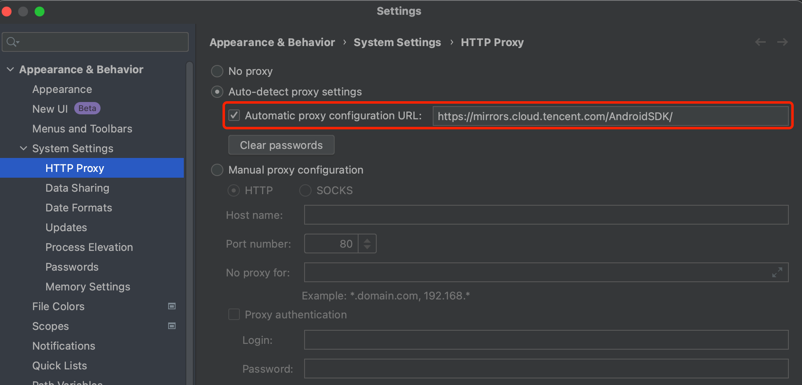

# android studio初始化配置踩坑

## gradle 下载慢（右下角一直gradle download）
gradle 全局换源，修改或新建文件：~/.gradle/init.gradle
```
allprojects {
    repositories {
        maven {
            url "https://maven.aliyun.com/nexus/content/groups/public"
        }
    }
}
```

## 设置sdk下载代理（二选一）
* 腾讯：https://mirrors.cloud.tencent.com/AndroidSDK/
* 阿里：https://mirrors.aliyun.com/android.googlesource.com/
